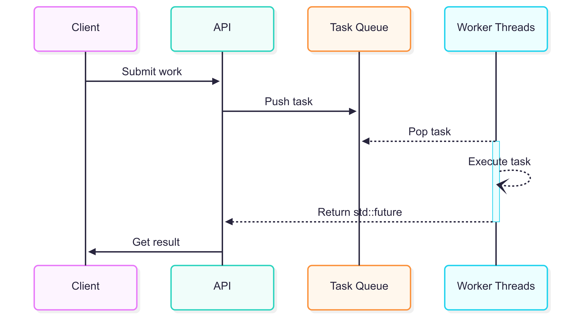

# Thread Pool

**-- WORK IN PROGRESS --**

A minimal, modern C++ thread pool implementation that uses:
- **Thread-safe ring buffer** for task queuing
- **Worker threads** automatically managed to pull and execute tasks
- **`std::future`** support for retrieving results from submitted work

## Features

- **Task submission with return values** — submit any callable and get a `std::future` back
- **Thread-safe queue** — implemented via a ring buffer for efficient task storage
- **RAII worker management** — pool spawns and joins threads on creation/destruction
- **Minimal dependencies** — uses only the C++ standard library
- TODO: **Group dispatch** — submit work load as a batch to reduce synchronization overhead
- TODO: **Work stealing** — idle threads can steal work from other thread's queues

## Architecture



### Task Submission
- Tasks are pushed into a thread-safe ring buffer
- A std::packaged_task wraps the callable so that its return value can be retrieved via std::future

### Worker Threads
- A fixed set of threads repeatedly pulls tasks from the queue
- When a task is available, it is executed immediately

### Shutdown
- On destruction, the pool signals workers to stop and joins all threads

## Example usage
```cpp
#include <thread_pool/thread_pool.hpp>

#include <iostream>

int main() {
    ThreadPool::ThreadPool pool(4); // Create pool with 4 worker threads

    std::vector<std::future<int>> results; // Store futures to iterate on

    for(int i = 0; i < 8; ++i) // Push work to the thread pool's queue
    {
        auto future = pool.Submit([i]{
            return i + i;
        });

        results.emplace_back(std::move(future));
    }

    pool.Wait(); // Ensure all work is done

    for(auto& result : results) // Iterate over all futures to get computed results
    {
        std::cout << future.get() << '\n';
    }

    return 0;
}
```

## Build instructions

This project comes with a CMake integration option. If you wish to link this as an **INTERFACE** library, you just need to build with CMake and link **ThreadPool** against your executable.
```
# Build the interface only
cmake -S . -B out -G Ninja

# Build tests and benchmarks as well
cmake -S . -B out -G Ninja -DBUILD_TESTS=ON
```

## Requirements

- C++17 or newer
- CMake 3.12 or newer (if using CMake integration)

## Credits

TODO - Add resources used for this project
